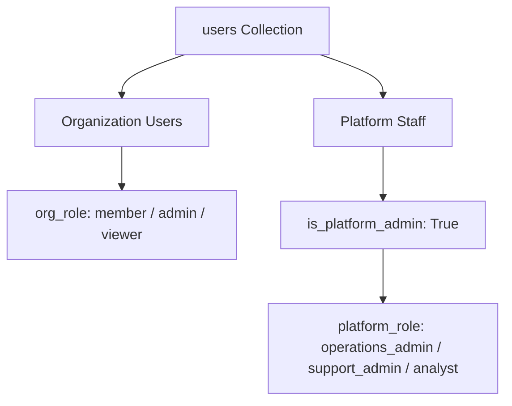
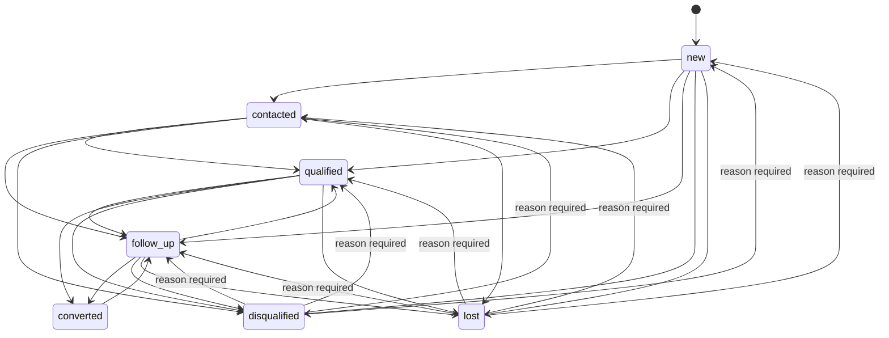

# Data Model Consolidation & Canonical Architecture

## 1. Executive Summary & Objectives

During the evolution of the platform, several domain-specific schemas, real-estate naming artifacts, and dual identity collections emerged. Phase 3 consolidates these disparate models into a single canonical, industry-agnostic, and platform-neutral foundation:

1. **Single Source of Truth for Identity**: The `users` collection is the sole canonical store for all users, organization members, and platform staff (`is_platform_admin=True`). The legacy `admin_users` collection is deprecated and consolidated.
2. **Raw Social Data vs. AI Lead Intelligence**:
   - `social_*` (`social_pages`, `social_posts`, `social_comments`): Store raw scraped social payloads from any platform (Facebook, Instagram, LinkedIn, YouTube).
   - `ai_comments`: Stores enriched lead intelligence, qualification scores, and extraction signals linked to raw comments via `comment_ref`.
3. **Industry-Agnostic Intent Taxonomy**: Replaces legacy real-estate intents (`buying`, `rent`, `selling`, `broker_inquiry`) with 6 canonical intents (`purchase_inquiry`, `pricing_inquiry`, `partnership`, `support`, `job_seeker`, `other`), while maintaining backward compatibility via alias normalization.
4. **Relaxed Lead Lifecycle State Machine**: Permits practical sales workflows including `contacted` -> `disqualified`, `qualified` -> `converted`, and allows reopening `lost` or `disqualified` leads back to active pipeline stages with a mandatory reason audit.
5. **Zero-Downtime Compatibility & Rollback**: Transparent collection access via `app.db.compatibility`, idempotent migration (`scripts/migrate_social_collections.py`), safe rollback (`scripts/rollback_social_collections.py`), and collection auditing (`scripts/cleanup_legacy_collections.py`).

---

## 2. Canonical Identity Model

### 2.1 Single Source of Truth: `users` Collection
Previously, platform administration maintained a secondary collection (`admin_users`) alongside the primary `users` collection. Under the consolidated architecture, `users` is the authoritative collection for all actors:



### 2.2 Platform Admin Fields in `users`
| Field | Type | Description |
| :--- | :--- | :--- |
| `is_platform_admin` | `boolean` | `true` if user possesses cross-tenant platform management rights. |
| `platform_role` | `string` | Granular staff role: `operations_admin`, `support_admin`, `analyst`. |
| `organization_id` | `string` | Tenant scope. For platform staff operating globally, set to `"system"`. |
| `hashed_password` | `string` | Bcrypt or Argon2 password hash. |

### 2.3 Superadmin Environment Security
In production environments (`ENV=production` or `ENV=prod`), environment variable superadmin bypasses with plaintext passwords are systematically rejected (`app/auth/superadmin.py`). Passwords must be verified against bcrypt hashes (`$2b$...` / `$2a$...`) stored in environment or DB settings.

---

## 3. Social Data vs. AI Lead Intelligence

### 3.1 Architecture Separation

```
[Social Scrapers / Apify]
       │
       ▼
┌─────────────────────────┐
│     social_pages        │  (Metadata for monitored pages/channels)
└───────────┬─────────────┘
            │
            ▼
┌─────────────────────────┐
│     social_posts        │  (Posts scraped across social platforms)
└───────────┬─────────────┘
            │
            ▼
┌─────────────────────────┐
│    social_comments      │  (Raw scraped comment text, author, platform)
└───────────┬─────────────┘
            │
            │  Enrichment via comment_ai pipeline
            ▼
┌─────────────────────────┐
│      ai_comments        │  (Lead intelligence: status, intent, score, signals)
└─────────────────────────┘
```

### 3.2 Collection Schemas & Field Mappings

#### `social_pages` (formerly `facebook_pages`)
- `_id`: ObjectId or synthetic string ID.
- `page_url`: Canonical page URL (platform neutral).
- `facebook_url`: Aliased for backward compatibility.
- `page_name`: Display name of page/account.
- `platform`: Social source (`facebook`, `instagram`, `linkedin`, `youtube`, etc.).
- `organization_id`: Scoped tenant ID.
- `last_scraped_at`: Timestamp of most recent scraper extraction.

#### `social_posts` (formerly `facebook_posts`)
- `_id`: Unique post ID or synthetic string.
- `post_id`: Platform-specific post ID.
- `page_url`: Canonical page identifier.
- `post_text`: Raw body of the post.
- `platform`: Social network platform.
- `organization_id`: Tenant ID.
- `scraped_at`: Ingestion timestamp.

#### `social_comments` (formerly `facebook_comments`)
- `_id`: Unique comment identifier.
- `comment_id`: Platform-specific comment ID.
- `post_id`: Associated post identifier.
- `page_url`: Associated page/channel URL.
- `comment_text`: Original unedited comment text.
- `comment_author`: Original author handle or name.
- `comment_author_id`: Platform author identifier (if available).
- `platform`: `facebook`, `instagram`, etc.
- `organization_id`: Tenant ID.

#### `ai_comments` (Lead Intelligence Collection)
- `_id`: Unique lead record ID.
- `comment_ref`: Reference linking back to `social_comments._id`.
- `page_url`: Platform-neutral page/channel URL.
- `facebook_url`: Deprecated backward-compatible alias.
- `comment_text`: Extracted text analyzed by AI.
- `lead_status`: Pipeline status (`new`, `contacted`, `qualified`, `follow_up`, `converted`, `disqualified`, `lost`).
- `intent`: Canonical intent (`purchase_inquiry`, `pricing_inquiry`, `partnership`, `support`, `job_seeker`, `other`).
- `intent_score`: Confidence score (0.0 to 1.0).
- `urgency_score`: Lead priority score (0.0 to 1.0).
- `display_signals`: Extracted structured entities (budget, location, contact, requested service).
- `history`: Audit log tracking status transitions, timestamps, user ID, and transition reasons.
- `organization_id`: Strict multi-tenant scope.

---

## 4. Canonical Intent Taxonomy

### 4.1 Industry-Agnostic Intents
All comment classification in `app/pipeline/comment_ai.py` maps into 6 canonical intents:

| Canonical Intent | Definition | Examples |
| :--- | :--- | :--- |
| `purchase_inquiry` | Explicit interest in acquiring products, booking services, or engaging. | *"I want to buy this"*, *"Where can I order?"*, *"Interested in booking"* |
| `pricing_inquiry` | Inquiries regarding cost, rates, quotes, discounts, or packages. | *"How much does this cost?"*, *"What is your price list?"*, *"Can I get a quote?"* |
| `partnership` | B2B, vendor, affiliate, or collaborative inquiries. | *"Are you open to wholesale collaboration?"*, *"Let's partner together"* |
| `support` | Existing customer support, issue reporting, or service requests. | *"My delivery hasn't arrived"*, *"The link is broken"*, *"Need help with my account"* |
| `job_seeker` | Employment inquiries, resumes, or career interest. | *"Are you hiring?"*, *"Where can I send my CV?"*, *"Any vacancies available?"* |
| `other` | Casual engagement, complaints, spam, greetings, or non-lead text. | *"Nice photo!"*, *"Good morning"*, *"Scam page beware"* |

### 4.2 Backward-Compatible Intent Alias Mapping
The `normalize_intent()` function automatically maps legacy terms to canonical values:

| Legacy Term | Canonical Normalized Intent |
| :--- | :--- |
| `buying`, `buy`, `buyer`, `purchase`, `booking`, `booking_inquiry` | `purchase_inquiry` |
| `pricing`, `price`, `cost`, `quote`, `rate` | `pricing_inquiry` |
| `broker_inquiry`, `agent_collaboration`, `affiliate`, `collaboration`, `b2b` | `partnership` |
| `support_request`, `help`, `customer_care`, `service` | `support` |
| `job_inquiry`, `hiring`, `career`, `resume` | `job_seeker` |
| `selling`, `rent`, `general`, `general_inquiry`, `spam` | `other` |

---

## 5. Lead Lifecycle State Machine

### 5.1 Permitted State Transitions
The state machine in `app/pipeline/lead_lifecycle.py` enforces valid sales workflow transitions:



### 5.2 Mandatory Reason Requirements
When reopening leads from terminal states (`disqualified` or `lost`), the API (`/api/search/leads/{lead_id}/status`) and UI mandate a non-empty `reason` payload. Attempts to reopen without a reason fail with HTTP 422 Unprocessable Entity.

---

## 6. Migration and Operational Runbook

### 6.1 Migration Execution
Run the migration script to copy and index documents into canonical collections:
```bash
# 1. Preview changes (non-destructive dry-run)
python scripts/migrate_social_collections.py --dry-run

# 2. Apply migration (idempotent upserts)
python scripts/migrate_social_collections.py --apply

# 3. Verify record parity
python scripts/migrate_social_collections.py --verify
```

### 6.2 Rollback Procedure
If legacy tooling requires writing exclusively to `facebook_*`, reverse changes using:
```bash
# Preview rollback
python scripts/rollback_social_collections.py --dry-run

# Execute sync back to legacy collections
python scripts/rollback_social_collections.py --apply
```

### 6.3 Database Cleanup & Audit
Audit database health and consolidate legacy `admin_users`:
```bash
# Run audit
python scripts/cleanup_legacy_collections.py --dry-run

# Apply consolidation of admin_users into users
python scripts/cleanup_legacy_collections.py --apply
```
